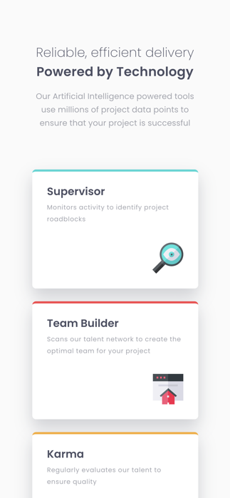
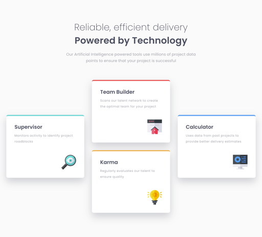

# Frontend Mentor - Four card feature section solution

This is a solution to the [Four card feature section challenge on Frontend Mentor](https://www.frontendmentor.io/challenges/four-card-feature-section-weK1eFYK). Frontend Mentor challenges help you improve your coding skills by building realistic projects. 

## Table of contents

- [Frontend Mentor - Four card feature section solution](#frontend-mentor---four-card-feature-section-solution)
  - [Table of contents](#table-of-contents)
  - [Overview](#overview)
  - [Screenshot](#screenshot)
    - [Mobile View:](#mobile-view)
    - [Desktop View:](#desktop-view)
    - [Links](#links)
  - [My process](#my-process)
    - [Built with](#built-with)
    - [What I learned](#what-i-learned)
    - [Useful resources](#useful-resources)
  - [Acknowledgments](#acknowledgments)

## Overview

Mockup of a webpage with four cards using CSS grid. When user views it in mobile view, the cards are stacked on top of each other. And in desktop view, the cards are side-by-side in a plus shaped pattern

## Screenshot

### Mobile View:

### Desktop View:

### Links

- Live Site URL: [https://py-code314.github.io/four-card-feature-section/](https://py-code314.github.io/four-card-feature-section/)

## My process

Started with mobile view and added media queries to change it to desktop view.

### Built with

- Semantic HTML5 markup
- Sass
- Flexbox
- CSS Grid
- Mobile-first workflow

### What I learned

Tried 'node.js' to compile Sass files into CSS instead of the extension.

### Useful resources

Used this [Static Site Setup](https://thinkdobecreate.com/articles/minimum-static-site-sass-setup/)  file from Stephanie Eckles instead of 'gulp' to compile CSS files.

## Acknowledgments

- Thanks to [Stephanie Eckles](https://thinkdobecreate.com/) for the Static Site Setup
